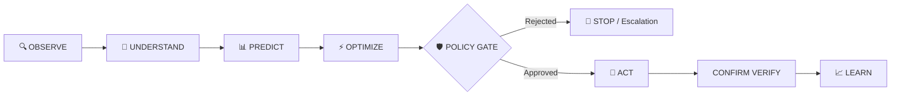
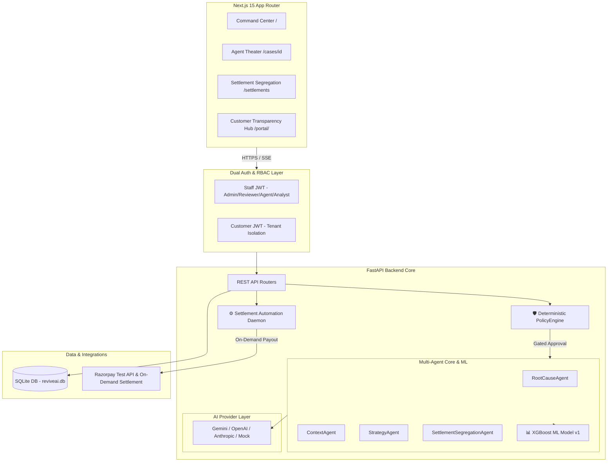
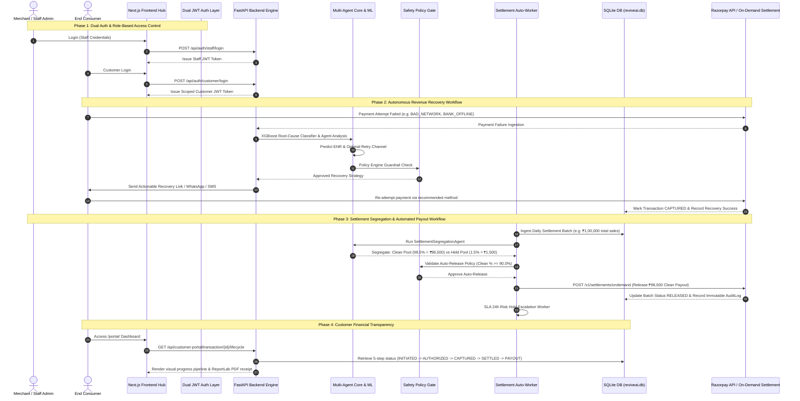

<div align="center">

# ⚡ ReviveAI
### Autonomous Agentic Revenue Recovery & Settlement Risk Segregation Platform

[](https://python.org)
[](https://fastapi.tiangolo.com)
[](https://nextjs.org)
[](https://react.dev)
[](https://typescriptlang.org)
[](https://xgboost.readthedocs.io)
[](https://razorpay.com)
[](#-testing)
[](#-testing)
[-blue?style=for-the-badge)](#-license)
[](#-team--hackathon-context)

<p align="center">
  <b>Eliminating revenue leakage & unlocking merchant settlement liquidity through autonomous multi-agent reasoning.</b>
</p>

<!-- Hero Screenshot/GIF Placeholder: Record a 10-15s GIF of the Agent Theater SSE stream & Command Center running a scenario, save as docs/assets/hero-demo.gif, and replace this block -->
<p align="center">
  
</p>

<p align="center">
  <a href="#-quick-interactive-demo-tour">🎮 Live Interactive Tour</a> •
  <a href="#-key-features">✨ Key Features</a> •
  <a href="#-system-architecture--flowcharts">🏗️ Architecture</a> •
  <a href="#-ml-model--expected-value-math">📊 ML Model</a> •
  <a href="#-getting-started--running-guide">🚀 Start Guide</a> •
  <a href="#-api-playground--specification">📡 API Spec</a> •
  <a href="#-testing--verification">🧪 Testing</a>
</p>

---

</div>

## 📌 The Problem

Payment failures cause **10% to 15% revenue leakage** for digital merchants. Standard recovery tools treat failures as flat retry tasks or spam customers with generic notifications, damaging brand trust. Meanwhile, payment gateways lock up **100% of a merchant's daily settlement batch** whenever a tiny fraction (~1.5%) exhibits fraud risk signals.

> **The Result**: Millions in recoverable revenue are lost, customer churn spikes, and honest businesses suffer severe working capital freezes due to indiscriminate payout holds.

---

## 💡 The Solution

**ReviveAI** runs an autonomous, closed-loop revenue optimization engine that transforms payment failures into net recovered revenue while unlocking merchant payout liquidity.



- **Observe & Understand**: Ingests gateway failure webhooks and contextualizes customer profile, LTV, and historical recovery signals.
- **Predict & Optimize**: XGBoost predicts recovery probability ($P_{\text{recovery}}$); LLM multi-agent core calculates **Expected Net Recovery (ENR)**.
- **Deterministic Policy Gate**: **Hard safety ceiling.** Every action must satisfy strict boolean constraints before any external intervention occurs.
- **Act & Verify**: Executes localized payment retry links, discount incentives, or instant settlement fund releases, confirming capture before declaring recovery success.

---

## 🎮 Quick Interactive Demo Tour

<details open>
<summary><b>Click to expand Interactive Platform Tour & Modules Overview</b></summary>

| Interactive Module | Route / Path | Description & User Action |
| :--- | :--- | :--- |
| **🎛️ Command Center Dashboard** | `/` | Real-time recovery KPIs, Expected Net Recovery (ENR) metrics, and leakage breakdown maps. |
| **📡 Agent Theater** | `/cases/[id]` | Real-time Server-Sent Events (SSE) stream visualizing multi-agent reasoning & policy checks. |
| **🏦 Settlement Risk Segregation** | `/settlements` | Segregates daily merchant batches (e.g. ₹1,00,000 total). Releases **100% clean funds** (₹98,500) via Razorpay On-Demand Settlement APIs while isolating held risk pool (₹1,500). |
| **⚡ Automated Settlement Worker** | `/settlements` | Live status badge (`Auto-Payout Worker: ACTIVE`) with toggle switch and manual auto-cycle trigger button. |
| **🔍 WHY Explainability Panel** | `/cases/[id]` | Plain-language customer transparency explaining failure root causes without exposing internal ML. |
| **👑 Staff Review Queue** | `/review` | Human-in-the-loop review queue for staff reviewers (`ADMIN`, `RISK_REVIEWER`) with mandatory override reasons. |
| **💎 Customer Financial Portal** | `/portal/` | End-consumer hub: 5-step payment lifecycle tracker, ReportLab PDF tax invoices, tokenized card vault with expiry warnings, and refund tracking. |
| **🚀 Hackathon Live Simulator** | `/demo` | Zero-configuration demo sandbox executing recovery & risk segregation across **10,000 synthetic transactions**. |

</details>

---

## 🔥 Key Features

| Feature | Description |
| :--- | :--- |
| 🎯 **Multi-Agent Diagnosis** | `RootCauseAgent` & `ContextAgent` perform LLM diagnosis of root causes (`BANK_OFFLINE`, `INSUFFICIENT_FUNDS`, `NETWORK_ERROR`). |
| 📊 **XGBoost Recovery Predictor** | Machine learning classifier trained on 12,000 transaction records (**ROC-AUC: 0.8088, F1: 0.8094**) returning calibrated probabilities. |
| ⚡ **ENR Optimization Math** | Calculates $\text{ENR} = (\text{Amount} \times P_{\text{recovery}}) - \text{InterventionCost} - \text{FrictionCost} - \text{RiskPenalty}$. |
| 🔒 **Deterministic Guardrails** | Strict `PolicyEngine` safety rules: `MAX_RETRIES=2`, `MIN_PROBABILITY=0.60`, `MAX_AMOUNT=₹25,000`, `COOLDOWN=6h`, Customer Opt-Out = STOP. |
| 📡 **Real-Time Agent Theater** | Live Server-Sent Events (SSE) stream displaying agent reasoning steps, ML probabilities, and policy safety checks in real-time. |
| 🏦 **Settlement Risk Segregation** | Evaluates daily merchant batches (e.g. ₹1,00,000 total volume). Isolates ~1.5% held risk pool while releasing **100% of clean funds** (₹98,500). |
| ⚙️ **Settlement Auto-Worker** | Background daemon executing closed-loop settlement cycles every 5 mins with 24-hour SLA auto-escalation for unreviewed risk holds. |
| 👑 **Staff Portal & RBAC** | Role-Based Access Control (`ADMIN`, `RISK_REVIEWER`, `SUPPORT_AGENT`, `ANALYST`) with override reason enforcement & audit logs. |
| 💎 **Customer Transparency Hub** | Secure portal (`/portal/`) featuring a 5-step lifecycle tracker, ReportLab PDF tax invoices, card expiry warnings, & refund tracking. |

---

## 🖼️ Live Demo & Screenshots Showcase

> *All screenshot placeholders below point to `docs/assets/`. Take 1920x1080 resolution screenshots of your running app and place them in `docs/assets/`.*

| Screen / View | Preview Placeholder | Description |
| :--- | :--- | :--- |
| **Command Center Dashboard** |  | Real-time recovery KPIs, ENR metrics, and revenue leakage breakdown map. |
| **Agent Theater SSE Stream** |  | Live streaming decision timeline showing LLM reasoning & policy validation. |
| **WHY Explainability Panel** |  | Plain-language customer transparency explaining failure cause & recovery steps. |
| **Settlement Segregation Hub** |  | Segregated clean pool payout (₹98,500) vs held risk pool (₹1,500) with Razorpay integration. |
| **Staff Review Queue & Policy Sandbox** |  | Risk reviewer override panel with mandatory reason enforcement & non-persisted simulator. |
| **Customer Financial Portal** |  | End-consumer hub featuring 5-step lifecycle tracking, PDF tax receipts, & expiry alerts. |

---

## 🏗️ System Architecture & Flowcharts

### 1. High-Level Component Flow



### 2. End-to-End Sequence Flow



### 🔐 Why This Architecture: The "LLM Proposes / Policy Decides" Safety Boundary

In financial systems, LLMs must **never** be allowed to execute actions autonomously without deterministic boundaries. 

ReviveAI implements a strict **LLM Proposes / Policy Decides** safety wall:
1. **LLM & ML Layer**: Proposes root-cause diagnoses, recovery strategies, and calculates Expected Net Recovery (ENR).
2. **Policy Engine Boundary**: A deterministic, rule-based gate (`backend/policy/engine.py`) evaluates the proposal against hard boolean limits (`MAX_RETRIES=2`, `MIN_PROBABILITY=0.60`, `MAX_AMOUNT=₹25,000`, `COOLDOWN=6h`, `OPT_OUT`).
3. **Execution**: An action is executed via Razorpay APIs **only if the Policy Engine returns `approved: true`**. No LLM prompt or output can bypass this guardrail.

---

## 📊 ML Model & Expected Value Math

<details open>
<summary><b>Click to view XGBoost Evaluation Metrics & Formulae</b></summary>

### 1. XGBoost Recovery Model Performance (`xgb_v1`)
Trained on 12,000 transaction records with isotonic probability calibration:

| Evaluation Metric | Value | Meaning |
| :--- | :--- | :--- |
| **Model Version** | `xgb_v1` | Gradient boosted decision trees |
| **Precision** | `75.75%` | High confidence in predicted recoveries |
| **Recall** | `86.90%` | Identifies 86.9% of all recoverable transactions |
| **F1-Score** | `0.8094` | Balanced precision and recall metric |
| **ROC-AUC** | `0.8088` | Excellent class separation capability |
| **Brier Score** | `0.1707` | Low probability calibration error |

### 2. Expected Net Recovery (ENR) Formulation
$$\text{ERV} = \text{TransactionAmount} \times P_{\text{recovery}}$$
$$\text{ENR} = \text{ERV} - \text{InterventionCost} - \text{FrictionCost} - \text{RiskPenalty}$$

An automated recovery intervention is triggered **only if $\text{ENR} > 0$** and approved by the `PolicyEngine`.

</details>

---

## 🛠️ Tech Stack Matrix

| Domain | Primary Technology | Version | Purpose / Package |
| :--- | :--- | :--- | :--- |
| **Backend** | Python / FastAPI | `3.12.2` / `0.110.0` | Asynchronous web framework & REST APIs |
| **Server Engine** | Uvicorn | `0.29.0` | ASGI server implementation |
| **Database ORM** | SQLAlchemy / SQLite | `2.0.29` | Database models & session management |
| **Schema Validation** | Pydantic / Pydantic Settings | `2.7.1` / `2.2.1` | Data contracts & settings management |
| **Machine Learning** | XGBoost / Scikit-learn | `2.0.3` / `1.4.2` | Calibrated recovery prediction model (`xgb_v1`) |
| **Data Processing** | Pandas / NumPy / Joblib | `2.2.2` / `1.26.4` | Feature engineering & model serialization |
| **Frontend** | Next.js (App Router) / React | `16.3.2` / `19.2.8` | Server-rendered React frontend framework |
| **Language** | TypeScript | `5.0` | End-to-end type safety |
| **Styling** | Tailwind CSS / Lucide React | `4.0` / `1.33.0` | Modern responsive UI & vector icons |
| **Data Visualization**| Recharts | `3.10.1` | Analytics charts & monthly spend trends |
| **Payment Integration**| Razorpay Python SDK | `1.4.1` | Payment gateway & On-Demand Settlement APIs |
| **Security & Auth** | Python-JOSE / Passlib (Bcrypt) | `3.3.0` / `1.7.4` | Dual JWT authentication & password hashing |
| **PDF Generation** | ReportLab | System | Instant customer tax invoice generation |
| **Testing** | Pytest / Pytest-Asyncio | `8.2.0` / `0.23.6` | Automated test suite (56 passing tests) |

---

## 🚀 Getting Started & Running Guide

### Prerequisites
- **Python**: `3.12.0` or higher
- **Node.js**: `18.0.0` or higher (`npm` v9+)

### 1. Installation & Environment Setup

```bash
# Clone the repository
git clone https://github.com/your-username/revive-ai.git
cd revive-ai

# Step A: Backend Virtual Environment Setup
python -m venv venv

# Activate Virtual Environment:
# On Windows (PowerShell):
.\venv\Scripts\activate
# On Linux/Mac:
source venv/bin/activate

# Install Python backend dependencies
pip install -r backend/requirements.txt

# Step B: Frontend Dependencies Setup
cd frontend
npm install
cd ..
```

<details>
<summary><b>🔑 Click to view Environment Variables Matrix (.env)</b></summary>

Create a `.env` file in the root directory (copied from `.env.example`):

| Variable | Required? | Default / Example Value | Description |
| :--- | :--- | :--- | :--- |
| `DEMO_MODE` | Optional | `true` | When `true`, mocks real money movement & SMS delivery |
| `DATABASE_URL` | Required | `sqlite:///./reviveai.db` | SQLAlchemy connection string |
| `RAZORPAY_KEY_ID` | Optional | `rzp_test_placeholder` | Razorpay API Key ID (Test or Live) |
| `RAZORPAY_KEY_SECRET` | Optional | `placeholder_secret` | Razorpay API Secret |
| `RAZORPAY_WEBHOOK_SECRET`| Optional | `placeholder_webhook_secret`| Webhook verification secret |
| `AI_PROVIDER` | Optional | `openai` | AI provider (`openai`, `anthropic`, `gemini`, `mock`) |
| `AI_API_KEY` | Optional | `placeholder_key` | API key for LLM provider |
| `JWT_SECRET` | Required | `reviveai-dev-secret-key-2024` | Secret key for signing JWT tokens |
| `JWT_ALGORITHM` | Required | `HS256` | JWT signing algorithm |
| `ACCESS_TOKEN_EXPIRE_MINUTES` | Required | `1440` | Token expiration time (24 hours) |
| `APP_ENV` | Optional | `development` | Application environment (`development`/`production`) |
| `CORS_ORIGINS` | Optional | `http://localhost:3000` | Allowed CORS origins list |

</details>

### 2. Start Local Servers

Open **two terminal windows**:

#### **Terminal 1: Start Backend FastAPI Server**
```bash
# Ensure venv is activated
python backend/main.py
```
> 📍 Backend Server runs on **`http://localhost:8000`**  
> 📚 Interactive Swagger UI documentation is available at **`http://localhost:8000/docs`**

#### **Terminal 2: Start Frontend Next.js Web App**
```bash
cd frontend
npm run dev
```
> 📍 Frontend App runs on **`http://localhost:3000`**  
> 💎 Customer Portal is available at **`http://localhost:3000/portal`**

---

## 📡 API Playground & Specification

FastAPI automatically generates interactive OpenAPI Swagger documentation at **`http://localhost:8000/docs`**.

Below are core API endpoints driving the platform:

| Method | Path | Authorization | Purpose |
| :--- | :--- | :--- | :--- |
| `POST` | `/api/auth/staff/login` | Public | Authenticate staff user & issue role-scoped JWT token |
| `POST` | `/api/auth/customer/login` | Public | Authenticate customer & issue tenant-isolated JWT token |
| `POST` | `/api/recovery/events` | System / Webhook | Ingest failed payment & trigger autonomous recovery pipeline |
| `POST` | `/api/segregation/analyze-batch` | Staff (`ADMIN`/`REVIEWER`) | Run AI risk segregation on daily merchant settlement batch |
| `POST` | `/api/segregation/batch/{id}/release-clean` | Staff (`ADMIN`/`REVIEWER`) | Release 100% clean fund pool directly via Razorpay API |
| `POST` | `/api/segregation/auto-cycle` | Staff (`ADMIN`/`REVIEWER`) | Trigger immediate closed-loop automated settlement cycle |
| `GET` | `/api/segregation/automation-status` | Staff JWT | Fetch status & payout metrics of settlement auto-worker |
| `POST` | `/api/segregation/automation-toggle` | Staff (`ADMIN`) | Toggle background settlement auto-worker ON/OFF |
| `GET` | `/api/segregation/history` | Staff JWT | Query immutable settlement audit & action history |
| `GET` | `/api/customer-portal/transaction/{id}/lifecycle` | Customer JWT | Fetch 5-step payment lifecycle transparency pipeline |

---

## 🧪 Testing & Verification

ReviveAI includes an extensive automated Pytest suite validating safety guardrails, ML predictions, auth isolation, settlement segregation, and API contracts.

```bash
# Run backend test suite
python -m pytest backend/tests/ -v
```

<details open>
<summary><b>📋 Click to view Pytest Execution Results (56/56 Passed)</b></summary>

```text
============================= test session starts =============================
platform win32 -- Python 3.12.2, pytest-8.2.0 -- collected 56 items

backend/tests/test_api.py::test_health_endpoint PASSED                   [  1%]
backend/tests/test_api.py::test_dashboard_metrics_endpoint PASSED        [  3%]
backend/tests/test_api.py::test_payment_event_trigger_loop PASSED        [  5%]
backend/tests/test_api.py::test_simulator_batch_run PASSED               [  7%]
backend/tests/test_api.py::test_demo_scenarios_endpoint PASSED           [  8%]
backend/tests/test_auth_customer.py::test_request_otp_demo_mode PASSED   [ 10%]
backend/tests/test_auth_customer.py::test_verify_otp_valid PASSED        [ 12%]
backend/tests/test_auth_customer.py::test_customer_cannot_fetch_other_customer_orders PASSED [ 16%]
backend/tests/test_auth_staff.py::test_staff_login_valid_credentials PASSED [ 26%]
backend/tests/test_auth_staff.py::test_admin_can_access_user_management PASSED [ 35%]
backend/tests/test_customer_financials.py::test_customer_isolation PASSED [ 64%]
backend/tests/test_customer_financials.py::test_customer_download_pdf_receipt PASSED [ 72%]
backend/tests/test_segregation.py::test_settlement_history_endpoint PASSED [ 90%]
backend/tests/test_policy.py::test_policy_cooldown_period PASSED         [100%]

================= 56 passed in 96.83s =================
```

To run frontend static TypeScript verification:
```bash
cd frontend && npx tsc --noEmit
# Result: 0 errors
```

</details>

---

## 📁 Project Structure

```text
revive-ai/
├── backend/
│   ├── main.py                    # FastAPI app entrypoint & lifespan daemon worker
│   ├── config.py                  # Pydantic BaseSettings config
│   ├── database.py                # SQLAlchemy engine & session setup
│   ├── agents/                    # Multi-agent core (Segregation, Recovery, Context)
│   ├── ai/                        # Clean LLM provider abstraction layer
│   ├── api/                       # REST API routers (Auth, Recovery, Segregation, Portal)
│   ├── auth/                      # Dual JWT authentication & security utilities
│   ├── ml/                        # XGBoost training, feature engineering, prediction
│   ├── models/                    # SQLAlchemy database tables & relationships
│   ├── policy/                    # Deterministic PolicyEngine safety guardrails
│   ├── razorpay/                  # Razorpay Test API client & webhook handlers
│   ├── schemas/                   # Pydantic request/response schemas
│   ├── services/                  # Settlement automation manager & seed data service
│   └── tests/                     # Pytest suite (56 automated tests)
├── frontend/
│   ├── app/
│   │   ├── page.tsx               # Command Center Dashboard
│   │   ├── cases/                 # Active Recovery Cases & Agent Theater
│   │   ├── settlements/           # Settlement Risk Segregation & Action History
│   │   ├── portal/                # Customer Financial Transparency Hub
│   │   ├── review/                # Staff Human Review Queue
│   │   ├── simulator/             # 10,000-Transaction Batch Simulator
│   │   ├── settings/              # Merchant Policy Configuration
│   │   └── demo/                  # Hackathon Live Demo Simulator
│   ├── components/                # Reusable UI components (Navbar, Metrics, Maps)
│   └── lib/                       # API helpers & JWT utilities
├── docs/                          # Documentation assets & contributing guide
├── models/                        # Serialized XGBoost model pickles & metrics
└── reviveai.db                    # SQLite database
```

---

## 🛣️ Roadmap & Future Enhancements

- 🔜 **Production SMS & Email Delivery**: Integration with Twilio & SendGrid webhooks for real-world recovery link dispatches.
- 🔜 **WebSocket Event Bus**: Upgrading Server-Sent Events (SSE) to full bi-directional WebSockets for ultra-low latency agent stream processing.
- 🔜 **PostgreSQL Production Migration**: Database layer auto-migrations backed by Alembic for high-throughput enterprise scalability.
- 🔜 **Multi-Merchant Webhook Listener Daemon**: Multi-tenant Razorpay webhook listener for scaling across thousands of active merchants.

---

## 👥 Team & Hackathon Context

ReviveAI was architected and developed for **Razorpay Buildathon 2026**.

| Team Member | Role | GitHub | LinkedIn |
| :--- | :--- | :--- | :--- |
| **[Your Name]** | Lead Architect & Full Stack Engineer | [@your-username](https://github.com/your-username) | [LinkedIn](https://linkedin.com/in/your-profile) |
| **[Teammate Name]** | ML & Data Engineer | [@teammate-username](https://github.com/teammate-username) | [LinkedIn](https://linkedin.com/in/teammate-profile) |

---

## 📄 License

This project is licensed under the **MIT License** — see the [LICENSE](LICENSE) file for details.

---

<div align="center">

**[ReviveAI](https://github.com/your-username/revive-ai)** • Built with ❤️ for **Razorpay Buildathon 2026**

⭐ **Star this repository if you find ReviveAI useful!** ⭐

[](https://github.com/your-username/revive-ai)
[](https://github.com/your-username/revive-ai)

</div>
