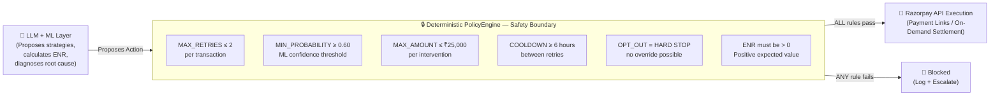
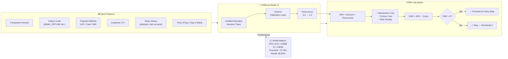
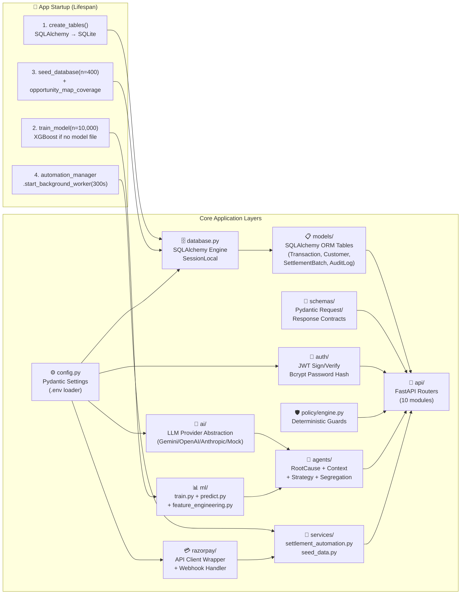
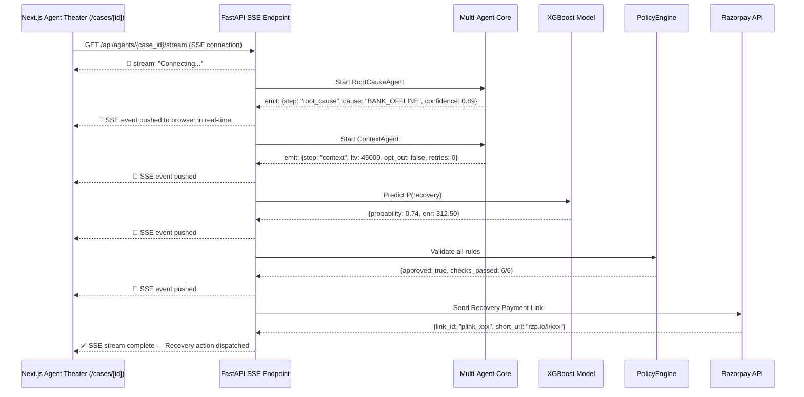

# ⚡ ReviveAI — Workflow Architecture Diagram & Explanation

> **Autonomous Agentic Revenue Recovery & Settlement Risk Segregation Platform**  
> Built for Razorpay Buildathon 2026

---

## 🗺️ 1. High-Level System Architecture

```mermaid
graph TB
    subgraph CLIENT ["🌐 Client Layer"]
        direction LR
        StaffUser["👑 Staff / Admin\n(Browser)"]
        CustomerUser["💎 End Consumer\n(Browser)"]
    end

    subgraph FRONTEND ["🖥️ Frontend — Next.js 15 App Router (localhost:3000)"]
        direction TB
        Dashboard["🎛️ Command Center\n/"]
        Theater["📡 Agent Theater\n/cases/[id]"]
        Settlements["🏦 Settlement Hub\n/settlements"]
        Portal["💎 Customer Portal\n/portal/"]
        Review["👑 Staff Review Queue\n/review"]
        Demo["🚀 Demo Simulator\n/demo"]
    end

    subgraph AUTH ["🔐 Dual JWT Auth & RBAC Layer"]
        StaffJWT["🔑 Staff JWT\n(Admin / Reviewer / Agent / Analyst)"]
        CustomerJWT["🔑 Customer JWT\n(Tenant Isolated)"]
    end

    subgraph BACKEND ["⚙️ Backend — FastAPI (localhost:8000)"]
        direction TB

        subgraph APIS ["📡 REST API Routers"]
            AuthStaffAPI["/api/auth/staff/*"]
            AuthCustAPI["/api/auth/customer/*"]
            RecoveryAPI["/api/recovery/*"]
            SegregationAPI["/api/segregation/*"]
            DashboardAPI["/api/dashboard/*"]
            PortalAPI["/api/customer-portal/*"]
            AuditAPI["/api/audit/*"]
        end

        subgraph AGENTS ["🤖 Multi-Agent Core"]
            RootCause["🔍 RootCauseAgent\n(LLM Diagnosis)"]
            Context["📚 ContextAgent\n(Customer Profile)"]
            Strategy["📋 StrategyAgent\n(ENR Calculation)"]
            SegAgent["🏦 SettlementSegregationAgent\n(Batch Risk Scoring)"]
        end

        subgraph ML ["📊 ML Engine"]
            XGBoost["🧠 XGBoost Model v1\n(ROC-AUC: 0.8088)\nCalibrated Probability"]
            ENR["⚡ ENR Formula\nAmount × P(recovery)\n− Costs − Penalties"]
        end

        subgraph AI ["🤖 AI Provider Abstraction"]
            LLMRouter["🔀 LLM Router\nGemini / OpenAI /\nAnthropic / Mock"]
        end

        Policy["🛡️ Deterministic PolicyEngine\nMAX_RETRIES=2 | MIN_PROB=0.60\nMAX_AMOUNT=₹25,000 | COOLDOWN=6h\nOPT_OUT=STOP"]

        AutoWorker["⚙️ Settlement Automation Daemon\n(Background Worker — 5min interval)"]
    end

    subgraph INFRA ["🗄️ Data & Integrations"]
        DB[("📦 SQLite DB\nreviveai.db")]
        RZP["💳 Razorpay API\nTest Gateway +\nOn-Demand Settlement"]
    end

    %% Client → Frontend
    StaffUser -->|"HTTPS"| Dashboard
    StaffUser -->|"HTTPS"| Theater
    StaffUser -->|"HTTPS"| Settlements
    StaffUser -->|"HTTPS"| Review
    CustomerUser -->|"HTTPS"| Portal

    %% Frontend → Auth
    Dashboard -->|"Bearer Token"| StaffJWT
    Theater -->|"Bearer Token"| StaffJWT
    Portal -->|"Bearer Token"| CustomerJWT

    %% Auth → APIs
    StaffJWT -->|"RBAC Validated"| APIS
    CustomerJWT -->|"Tenant Scoped"| APIS

    %% APIs → Core Layers
    RecoveryAPI -->|"Trigger Analysis"| AGENTS
    RecoveryAPI -->|"Read/Write"| DB
    SegregationAPI -->|"Batch Analysis"| SegAgent
    DashboardAPI -->|"Metrics Query"| DB
    PortalAPI -->|"Lifecycle Query"| DB
    AuditAPI -->|"Audit Logs"| DB

    %% Agents → ML & AI
    RootCause -->|"LLM Call"| LLMRouter
    Context -->|"LLM Call"| LLMRouter
    Strategy -->|"LLM Call"| LLMRouter
    SegAgent -->|"LLM Call"| LLMRouter
    RootCause -->|"Predict P(recovery)"| XGBoost
    Strategy -->|"Calculate"| ENR

    %% Policy Gate (Critical Safety Wall)
    AGENTS -->|"🚨 Propose Strategy"| Policy
    Policy -->|"✅ Approved Only"| RecoveryAPI

    %% Auto Worker
    AutoWorker -->|"Every 5 min"| SegAgent
    AutoWorker -->|"Validate"| Policy
    AutoWorker -->|"On-Demand Payout"| RZP
    AutoWorker -->|"Status / Logs"| DB

    %% Razorpay Integration
    RZP -->|"Payment Failure Webhook"| RecoveryAPI
    RecoveryAPI -->|"Recovery Link"| RZP

    %% DB Reads
    AGENTS -->|"Customer History"| DB
```

---

## 🔄 2. End-to-End Request Flow (4 Phases)

```mermaid
flowchart TD
    subgraph P1 ["🔐 Phase 1 — Authentication & RBAC"]
        L1["Staff/Customer opens app"]
        L2["POST /api/auth/staff|customer/login"]
        L3{"Credentials Valid?"}
        L4["Issue Role-Scoped JWT Token"]
        L5["❌ 401 Unauthorized"]
        L1 --> L2 --> L3
        L3 -->|Yes| L4
        L3 -->|No| L5
    end

    subgraph P2 ["⚡ Phase 2 — Autonomous Revenue Recovery"]
        A["💥 Payment Failure Event\n(Razorpay Webhook / Manual)"]
        B["FastAPI ingests event\nPOST /api/recovery/events"]
        C["🔍 RootCauseAgent\nLLM diagnoses failure cause\n(BANK_OFFLINE / INSUFFICIENT_FUNDS / NETWORK_ERROR)"]
        D["📚 ContextAgent\nFetches customer LTV, history, opt-out status"]
        E["🧠 XGBoost ML Model\nPredicts P(recovery) — calibrated probability"]
        F["📋 StrategyAgent\nCalculates ENR = Amount×P − Costs − Penalties\nSelects Optimal Channel (Link / WhatsApp / SMS)"]
        G{"🛡️ PolicyEngine\nGuardrail Check"}
        H["✅ APPROVED\nExecute Recovery Action"]
        I["❌ REJECTED\nLog reason, Escalate to Staff Review Queue"]
        J["📱 Send Actionable Recovery Link to Customer"]
        K{"Customer Re-attempts Payment?"}
        L["✅ CAPTURED — Recovery Success\nDB updated, ENR realized"]
        M["⏱️ Retry Cooldown Timer (6h)\nBack to queue"]

        A --> B --> C --> D --> E --> F --> G
        G -->|Approved| H --> J --> K
        G -->|Rejected| I
        K -->|Yes| L
        K -->|No| M
    end

    subgraph P3 ["🏦 Phase 3 — Settlement Segregation & Auto-Payout"]
        S1["⚙️ Background Worker triggers\n(Every 5 min via daemon)"]
        S2["Ingest Daily Merchant Batch\n(e.g. ₹1,00,000 total)"]
        S3["🏦 SettlementSegregationAgent\nAI Risk Scores each transaction\n(fraud signals, chargeback risk, etc.)"]
        S4["Segregate Batch:\n✅ Clean Pool (98.5% = ₹98,500)\n⚠️ Held Pool (1.5% = ₹1,500)"]
        S5{"PolicyEngine\nAuto-Release Check\n(Clean% ≥ 90%?)"}
        S6["POST /v1/settlements/ondemand\n→ Razorpay releases ₹98,500"]
        S7["✅ Batch Status = RELEASED\nImmutable AuditLog recorded"]
        S8["⚠️ Held Pool enters 24h SLA\nAwaits Staff Review Queue"]
        S9["SLA Expired → Auto-Escalate\nto ADMIN / RISK_REVIEWER"]

        S1 --> S2 --> S3 --> S4 --> S5
        S5 -->|Approved| S6 --> S7
        S5 -->|Rejected| S8 --> S9
    end

    subgraph P4 ["💎 Phase 4 — Customer Transparency Portal"]
        T1["Customer accesses /portal/"]
        T2["JWT auth validates tenant isolation"]
        T3["GET /api/customer-portal/transaction/{id}/lifecycle"]
        T4["5-Step Pipeline Rendered:\nINITIATED → AUTHORIZED → CAPTURED → SETTLED → PAYOUT"]
        T5["📄 ReportLab PDF Tax Invoice\nCard Vault Expiry Warnings\nRefund Tracking"]

        T1 --> T2 --> T3 --> T4 --> T5
    end

    L4 -.->|"Staff Login"| P2
    L4 -.->|"Customer Login"| P4
```

---

## 🛡️ 3. The Critical Safety Wall — LLM Proposes / Policy Decides

---

## 📊 4. ML Pipeline — XGBoost Recovery Predictor

---

## 🏗️ 5. Component Dependency Map

---

## 🔑 6. Authentication & Authorization Matrix

| Role | Auth Token | Permitted Actions |
|:---|:---|:---|
| `ADMIN` | Staff JWT | All operations + User management + Toggle auto-worker |
| `RISK_REVIEWER` | Staff JWT | Settlement segregation + Manual release + Override holds |
| `SUPPORT_AGENT` | Staff JWT | View recovery cases + Audit logs (read-only) |
| `ANALYST` | Staff JWT | Dashboard metrics + Reports (read-only) |
| `CUSTOMER` | Customer JWT | Own transactions only (tenant-isolated) + PDF receipts |

> **Tenant Isolation**: Customer JWT tokens are scoped to a specific customer ID. A customer can **never** fetch another customer's orders, invoices, or payment data — enforced at the API layer.

---

## 📡 7. Real-Time Agent Theater (SSE Stream)

---

## 📊 Key Numbers at a Glance

| Metric | Value |
|:---|:---|
| **ML Model** | XGBoost v1, trained on 12,000 records |
| **ROC-AUC** | 0.8088 (Excellent separation) |
| **F1-Score** | 0.8094 |
| **Test Suite** | 56/56 tests passing |
| **Settlement Release** | 98.5% clean funds unlocked |
| **Auto-Worker Interval** | Every 5 minutes |
| **SLA Escalation Window** | 24 hours |
| **Policy Guards** | 6 hard boolean rules (ALL must pass) |
| **API Endpoints** | 10 router modules, 30+ endpoints |
| **Auth Layers** | Dual JWT (Staff RBAC + Customer Tenant Isolation) |
